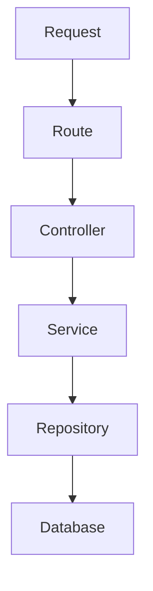

# Antigravity Alarm Analytics API - Technical Specification

## 📌 Project Overview
Xây dựng hệ thống API hiệu năng cao phục vụ:
* **Alarm Query:** Tra cứu dữ liệu cảnh báo chi tiết.
* **Alarm Analytics:** Phân tích xu hướng, tỷ trọng sự cố mạng.
* **Dashboard Visualization:** Cung cấp dữ liệu cho biểu đồ NOC.
* **Data Exploration:** Khám phá chuyên sâu các mẫu dữ liệu lỗi.
* **Root Cause Investigation:** Điều tra nguyên nhân gốc rễ sự cố.

### 💾 Data Storage
* **ClickHouse:** Lưu trữ Alarm Events (dữ liệu lớn, tối ưu phân tích).
* **PostgreSQL:** Lưu trữ Metadata (thiết bị, cấu hình trạm, lỗi mạng).

### ⚙️ Core Requirements
* Query dữ liệu alarm theo nhiều điều kiện lọc động.
* Tích hợp Dashboard Analytics với khả năng xử lý: Time Series, Top-N, Distribution, Heatmap, Compare.
* Hỗ trợ Export dữ liệu lớn.
* Thực hiện **Data Federation** tầng Application giữa ClickHouse và PostgreSQL.
* Tài liệu hóa toàn bộ bằng Swagger/OpenAPI.
* Khả năng mở rộng đến hàng trăm triệu bản ghi.

---

## 📌 Technology Stack
* **Runtime:** Node.js (ES2022+) & TypeScript.
* **Framework:** Express.js.
* **ClickHouse Client:** `@clickhouse/client` (Không sử dụng ORM).
* **PostgreSQL Driver:** `pg` (Không sử dụng ORM).
* **Validation:** `zod` (Bắt buộc sử dụng, không validate bằng if/else).
* **Logging:** `pino` & `pino-pretty`.
* **API Documentation:** `swagger-ui-express` & `swagger-jsdoc`.

---

## 📌 Architecture
Hệ thống được thiết kế theo kiến trúc phân tầng một chiều (Clean Layered Architecture):



### 🏢 Layer Responsibilities
1. **Route Layer:** Định tuyến endpoint HTTP, đăng ký Middleware (logging, validator). *Không chứa business logic.*
2. **Controller Layer:** Phân tích Request, lấy dữ liệu đã qua Validator, gọi Service và trả về Response. *Không chứa business logic.*
3. **Service Layer:** Xử lý Business Logic, Aggregation Logic, thực hiện **Data Federation** và map dữ liệu đầu ra.
4. **Repository Layer:** Xây dựng các câu lệnh SQL/ClickHouse cụ thể. *Không chứa business logic.*
5. **Database Layer:** Quản lý Connection Pool, chính sách retry và cấu hình Timeout.

---

## 📌 Database Architecture

### 🛸 ClickHouse Schema
Bảng lưu trữ cảnh báo sự cố thô:
```sql
CREATE TABLE alarms
(
    alarm_id String,
    error_code String,
    device_id String,
    time_created DateTime,
    time_solved Nullable(DateTime),
    status LowCardinality(String),
    severity LowCardinality(String),
    raw_log String,
    description String
)
ENGINE = MergeTree
PARTITION BY toYYYYMM(time_created)
ORDER BY (status, severity, device_id, time_created);
```
> [!NOTE]
> ClickHouse chịu trách nhiệm: Query alarms, Tìm kiếm, Lọc, Gom nhóm (Aggregation), Analytics, Time Series, và Tính toán thời gian xử lý. **Tuyệt đối không JOIN trực tiếp sang PostgreSQL.**

### 🐘 PostgreSQL Schema
Gồm 4 bảng metadata cấu hình được thiết kế như sau:

```sql
CREATE TABLE vendor (
    vendor_id VARCHAR(20) PRIMARY KEY,
    name VARCHAR(100) NOT NULL,
    country VARCHAR(50)
);

CREATE TABLE station (
    station_id VARCHAR(20) PRIMARY KEY,
    name VARCHAR(100) NOT NULL,
    longitude DOUBLE PRECISION,
    latitude DOUBLE PRECISION,
    province VARCHAR(100)
);

CREATE TABLE device (
    device_id VARCHAR(20) PRIMARY KEY,
    name VARCHAR(100) NOT NULL,

    vendor_id VARCHAR(20),
    station_id VARCHAR(20),

    device_type VARCHAR(50),
    ip_address VARCHAR(50),

    longitude DOUBLE PRECISION,
    latitude DOUBLE PRECISION,

    additional_info TEXT,

    CONSTRAINT fk_device_vendor
        FOREIGN KEY (vendor_id)
        REFERENCES vendor(vendor_id),

    CONSTRAINT fk_device_station
        FOREIGN KEY (station_id)
        REFERENCES station(station_id)
);

CREATE TABLE error (
    error_code VARCHAR(50) PRIMARY KEY,
    name VARCHAR(100) NOT NULL,

    description TEXT,
    domain VARCHAR(50),

    default_severity VARCHAR(20)
);

CREATE INDEX idx_device_vendor ON device(vendor_id); 

CREATE INDEX idx_device_station ON device(station_id);

CREATE INDEX idx_device_type ON device(device_type);
```

> [!NOTE]
> PostgreSQL chịu trách nhiệm: Tra cứu metadata, làm giàu dữ liệu (Label Enrichment), và lấy danh sách bộ lọc. **Không thực hiện tác vụ Analytics trên PostgreSQL.**

---

## 📌 Data Federation Rules

> [!IMPORTANT]
> **Nguyên tắc cốt lõi:** Không được phép thực hiện liên kết (JOIN) trực tiếp giữa ClickHouse và PostgreSQL. 

Quy trình gom dữ liệu liên hợp chuẩn:
```text
ClickHouse (Lấy dữ liệu Alarms)
    ↓
Thu thập danh sách IDs duy nhất (device_id, error_code)
    ↓
PostgreSQL (Query metadata theo danh sách IDs bằng WHERE id IN)
    ↓
Service Layer (Merge dữ liệu bằng Hash Map Lookup)
    ↓
Response (Trả về client dữ liệu đã làm giàu)
```

### 💡 Ví dụ Minh Họa
* **Bước 1 (Query ClickHouse):**
  ```sql
  SELECT alarm_id, device_id, severity, status FROM alarms;
  ```
* **Bước 2 (Gom ID duy nhất trên RAM):**
  ```javascript
  const deviceIds = [...new Set(rows.map(x => x.device_id))];
  ```
* **Bước 3 (Query Postgres):**
  ```sql
  SELECT * FROM device WHERE device_id = ANY($1);
  ```
* **Bước 4 (Map dữ liệu tại Service Layer):**
  ```javascript
  alarm.device = deviceMap[alarm.device_id];
  ```

---
## 📌 Common Analytics Filter Contract
Tất cả Analytics APIs phải sử dụng chung Filter DTO để tận dụng cơ chế tái sử dụng code. Không định nghĩa DTO riêng.

### Supported Query Parameters
```typescript
{
  from_time?: string;   // ISO-8601 string (Optional, default to 7 days ago)
  to_time?: string;     // ISO-8601 string (Optional, default to now)
  severity?: string[]; // Danh sách mức độ
  status?: string[];   // Danh sách trạng thái
  device_id?: string[];// Danh sách thiết bị lọc
  error_code?: string[];// Danh sách mã lỗi lọc
  // Các bộ lọc Postgres liên hợp:
  device_type?: string[];
  vendor?: string[];
  station?: string[];
  province?: string[];
}
```

* **Default Time Window:** Nếu client bỏ trống: `to_time = now()`, `from_time = now() - 7 days`.
* **Maximum Time Range:** Thời gian truy vấn tối đa không vượt quá **90 ngày** (Tránh làm quá tải CPU ClickHouse).

---

## 📌 API Design Principles

* **Reuse APIs:** Một API nên phục vụ được nhiều loại biểu đồ (Ví dụ: Distribution API trả về cơ cấu phần trăm có thể vẽ cả Pie, Donut, Bar Chart hoặc Treemap).
* **ClickHouse First:** Toàn bộ phép tính toán nặng (`count`, `group by`, tính `duration`, analytics) phải thực thi ở ClickHouse.
* **No OFFSET Pagination:** Cấm tuyệt đối dùng `OFFSET`. Sử dụng **Keyset/Cursor Pagination** để đạt hiệu năng $\mathcal{O}(\log N)$.
* **Partition Pruning:** Bắt buộc truyền `from_time` và `to_time` cho mọi Analytics API để ClickHouse cắt tỉa phân vùng đĩa.

---
## 📌 API Contracts

### 1. Alarm Detail API
* **Endpoint:** `GET /api/v1/alarms`
* **Purpose:** Bảng danh sách alarm, Drill-down từ biểu đồ.
* **Parameters:**
  * Time Filter: `from_time`, `to_time`
  * Alarm Filter: `severity`, `status`, `error_code`
  * Device Filter: `device_id`, `device_type`, `vendor`, `station`, `province`
  * Sorting: `sort_by` (`timestamp`, `severity`, `status`), `sort_order` (`asc`, `desc`)
  * Pagination: `cursor_time` (ISO-8601 string), `cursor_id` (string), `limit` (max 1000)
* **Pagination (Keyset SQL):**
  ```sql
  WHERE (
      time_created < :cursor_time
      OR (
          time_created = :cursor_time
          AND alarm_id < :cursor_alarm_id
      )
  )
  ORDER BY time_created DESC, alarm_id DESC
  LIMIT :limit;
  ```

---

### 2. Summary API
* **Endpoint:** `GET /api/v1/analytics/summary`
* **Purpose:** Cung cấp dữ liệu cho các KPI Card của Dashboard.
* **Supported Filters:**
  * Common Analytics Filter Contract (bao gồm các bộ lọc thời gian, severity, device, vendor...)
* **Response Shape (HTTP 200):** Trả về đối tượng JSON chứa các metric sau trong phần `data` (dạng camelCase):
  * `totalAlarms`: Tổng số lượng alarm.
  * `activeAlarms`: Số lượng alarm đang hoạt động (`status` là `active` hoặc `ACTIVE`).
  * `closedAlarms`: Số lượng alarm đã đóng (`status` thuộc `closed`, `solved`, `CLOSED`, `SOLVED`).
  * `criticalAlarms`: Số lượng alarm có mức độ nghiêm trọng là `critical` hoặc `CRITICAL`.
  * `affectedDevices`: Số lượng thiết bị duy nhất bị ảnh hưởng (`uniqExact(device_id)`).

---

### 3. Analytics Query API
* **Endpoint:** `POST /api/v1/analytics/query`
* **Purpose:** API phân tích tổng quát cho:
  * Line Chart
  * Bar Chart
  * Pie Chart
  * Top-N Ranking
  * Trend Analysis

* **Request Body:**
  ```json
  {
    "metric": "count",
    "group_by": ["severity"],
    "time_bucket": null,
    "filters": {
      "severity": ["critical"],
      "status": ["open"],
      "device_type": ["wifi"]
    },
    "limit": 20
  }
  ```

* **Supported Metrics:**
  ```text
  count
  avg_duration
  max_duration
  affected_devices
  ```

* **Supported Group By (ClickHouse Native):**
  ```text
  severity
  status
  error_code
  ```

* **Supported Group By (Federated PostgreSQL):**
  ```text
  device
  device_type
  vendor
  station
  province
  ```

* **Supported Time Buckets:**
  ```text
  hour
  day
  week
  month
  year
  ```

* **Ví dụ Use Cases:**

  Top 10 thiết bị phát sinh alarm:

  ```json
  {
    "metric": "count",
    "group_by": ["device"],
    "limit": 10
  }
  ```

  Tỷ lệ severity:

  ```json
  {
    "metric": "count",
    "group_by": ["severity"]
  }
  ```

  Alarm theo ngày:

  ```json
  {
    "metric": "count",
    "time_bucket": "day"
  }
  ```

  Alarm Critical + Open của thiết bị WiFi:

  ```json
  {
    "metric": "count",
    "group_by": ["device"],
    "filters": {
      "severity": ["critical"],
      "status": ["open"],
      "device_type": ["wifi"]
    }
  }
  ```

---

### 4. Heatmap API
* **Endpoint:** `POST /api/v1/analytics/heatmap`
* **Purpose:** Biểu đồ mật độ cảnh báo theo thời gian.
* **Supported Filters:**
  * `from_time`, `to_time`
  * `severity`, `status`
  * `error_code`
  * `device_id`, `device_type`
  * `vendor`, `station`, `province`

* **Parameters:** `mode`

### Mode: `weekday`
Giờ × Thứ trong tuần

```sql
SELECT
    toDayOfWeek(time_created) AS day_of_week,
    toHour(time_created) AS hour,
    count() AS count
FROM alarms
WHERE time_created BETWEEN :from_time AND :to_time
GROUP BY day_of_week, hour;
```

### Mode: `calendar`
Giờ × Ngày trong năm

```sql
SELECT
    toDate(time_created) AS day,
    toHour(time_created) AS hour,
    count() AS count
FROM alarms
WHERE time_created BETWEEN :from_time AND :to_time
GROUP BY day, hour;
```

* **Response Shape:**

```json
[
  {
    "x": 13,
    "y": "Monday",
    "value": 120
  }
]
```

hoặc

```json
[
  {
    "x": 13,
    "y": "2025-01-01",
    "value": 120
  }
]
```

* **Lưu ý:**
  * Bắt buộc có `from_time` và `to_time` để tận dụng Partition Pruning.
  * Không sử dụng `OFFSET`.
  * Không load toàn bộ dữ liệu lớn vào RAM.
  * Chỉ trả về dữ liệu aggregate đã group.

---

### 5. Export API
* **Endpoint:** `POST /api/v1/export`
* **Purpose:** Xuất dữ liệu đã lọc ra file CSV hoặc Excel.
* **Formats:**
  * `csv`
  * `xlsx`
* **Yêu cầu:**
  * Sử dụng Stream.
  * Không load toàn bộ dữ liệu vào RAM.
  * Hỗ trợ export tập dữ liệu lớn.
* **Request Body Schema:**
  ```json
  {
    "format": "csv" | "xlsx",
    "columns": ["alarm_id", "severity", "status", "device_name", "error_name", "..."], // Optional. Nếu không truyền, mặc định sẽ xuất tất cả các cột.
    "filters": {
      // Common Analytics Filter Contract:
      "from_time": "2026-06-01T00:00:00Z",
      "to_time": "2026-06-07T23:59:59Z",
      "severity": ["critical"],
      "device_type": ["wifi"],
      // Sắp xếp và giới hạn bản ghi:
      "sort_by": "timestamp" | "severity" | "status",
      "sort_order": "asc" | "desc",
      "limit": 1000
    }
  }
  ```
---

## 📌 ClickHouse Optimization Rules
* **Không sử dụng `SELECT *`:** Luôn khai báo tường minh cột cần lấy.
* **Ưu tiên lọc trên index:** Lọc theo các trường trong Order Key (`time_created`, `severity`, `status`).
* **LowCardinality:** Áp dụng trên cột có độ đa dạng thấp như `severity` và `status` để nén tốt hơn.
* **PREWHERE:** Luôn dùng `PREWHERE` cho khoảng thời gian để nạp ít cột vào RAM nhất.

---

## 📌 Connection & System Management

### ⚙️ Connection Management
* **PostgreSQL Pool:** Thiết lập `new Pool({ max: 20 })`.
* **ClickHouse Client:** Bắt buộc dùng **Singleton Pattern** để chia sẻ kết nối toàn app.

### ⏱️ Query Timeout & SLA
* **PostgreSQL Timeout:** `5s`.
* **ClickHouse Timeout:** `30s`.
* *Xử lý khi Timeout:* Hủy query (Cancel query), Ghi nhận lỗi qua Pino (`appLogger.error`), Trả về HTTP Status `504 Database Timeout`.

### 🛡️ Query Safety Rules
* **Max Top-N:** Giới hạn $N \le 1000$.
* **Max Group By Columns:** Tối đa 3 cột.
* **Sorting Whitelist:** Chỉ cho phép sort theo `time_created`, `severity`, `status`, và `count`. Cấm nhận trực tiếp cột SQL thô từ Client.

---

## 📌 Response Standards

### ✅ Success Response (HTTP 200)
```json
{
  "success": true,
  "data": [],
  "meta": {
    "execution_time_ms": 120
  }
}
```

### ❌ Error Response (HTTP 4xx / 5xx)
```json
{
  "success": false,
  "error": {
    "code": "INVALID_TIME_RANGE",
    "message": "from_time must be earlier than to_time"
  }
}
```

### 🚥 HTTP Status Codes
* **200:** Thành công.
* **400:** Lỗi Validation dữ liệu đầu vào.
* **404:** Không tìm thấy tài nguyên.
* **429:** Quá tải tần suất yêu cầu (Rate Limited).
* **500:** Lỗi hệ thống nội bộ.
* **504:** Database bị Timeout quá SLA.

---

## 📌 Logging & Observability
Bắt buộc sử dụng **Pino**. In log dạng JSON có cấu trúc để phục vụ giám sát tập trung.

### Required Fields for HTTP Logging
```json
{
  "request_id": "req_123",
  "endpoint": "/api/v1/alarms",
  "clickhouse_query_time_ms": 95,
  "postgres_query_time_ms": 12,
  "execution_time_ms": 110,
  "records_returned": 100
}
```
> [!WARNING]
> Mọi API phản hồi chậm hơn ngưỡng SLA cho phép (500ms cho API thông thường, 2s/3s cho API Analytics) bắt buộc phải in log cảnh báo `appLogger.warn`.

---

## 📌 Performance Targets
* **Alarm Query API:** P95 < 500ms
* **Analytics APIs:** P95 < 2s
* **Distribution / Top-N APIs:** P95 < 3s

---

## 📌 Testing & Definition Of Done

### 🧪 Testing Requirements
* **Bắt buộc:** Viết Unit Tests cho lớp Service và các bộ dữ liệu Validator.
* **Khuyến nghị:** Viết Integration Tests kết nối DB giả lập.

### 🏁 Definition Of Done (DOD)
* Hoàn thành đúng đặc tả cả 8 API chức năng (bao gồm cả heatmap, summary...).
* Data Federation hoạt động chính xác, không join trực tiếp 2 cơ sở dữ liệu.
* Dữ liệu validate chặt chẽ bằng Zod. Logs đầy đủ bằng Pino.
* Phân trang qua Cursor Pagination hoạt động mượt mà.
* Không sử dụng ORM, không dùng `SELECT *`, không dùng `OFFSET`.
* Swagger hiển thị tài liệu API đầy đủ tại `/api-docs`.