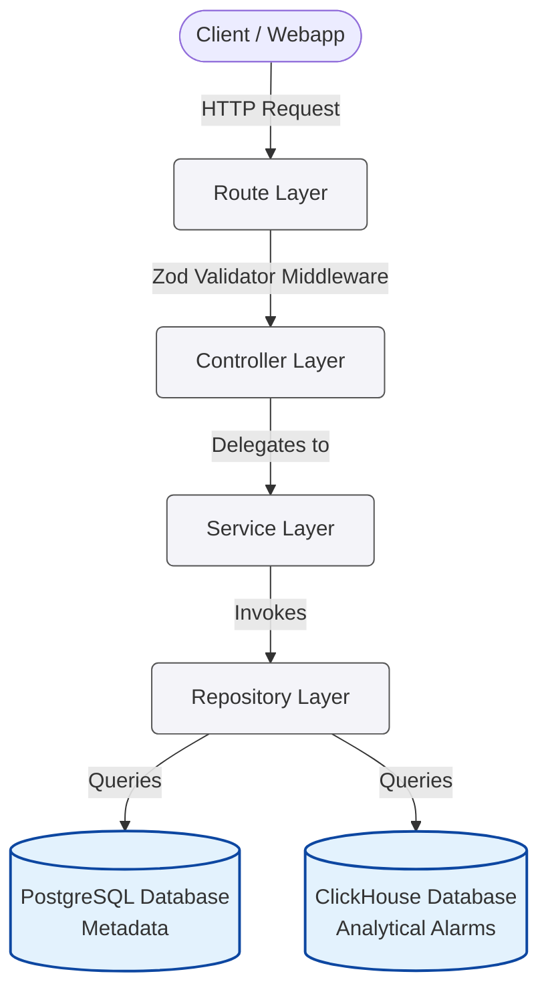

# ⚡ NetTrace Alarms Analytics API

<div align="center">
  
  
  
  
  
  
</div>

<br />

A high-performance Express.js backend API implemented in TypeScript. It combines **ClickHouse** (for high-speed analytical logs) and **PostgreSQL** (for relational configuration metadata) to deliver sub-second analytics, aggregations, and data federation for NetTrace network alarms.

---

## 📌 Table of Contents

* [🏗️ Architecture Design](#%EF%B8%8F-architecture-design)
* [🔗 Data Federation Mechanism](#-data-federation-mechanism)
* [⚡ Query Optimization & Rules of Thumb](#-query-optimization--rules-of-thumb)
* [📂 Folder Structure](#-folder-structure)
* [💡 Key Notes & Important Constraints](#-key-notes--important-constraints)
* [🧭 Implemented Endpoints & Examples](#-implemented-endpoints--examples)
  1. [Detail Queries (`GET /api/v1/alarms`)](#1-detail-queries-get-apiv1alarms)
  2. [Operational Summary KPIs (`GET /api/v1/analytics/summary`)](#2-operational-summary-kpis-get-apiv1analyticssummary)
  3. [Dynamic Analytics Query (`POST /api/v1/analytics/query`)](#3-dynamic-analytics-query-post-apiv1analyticsquery)
  4. [Heatmap Density Analysis (`POST /api/v1/analytics/heatmap`)](#4-heatmap-density-analysis-post-apiv1analyticsheatmap)
  5. [Stream Export (`POST /api/v1/export`)](#5-stream-export-post-apiv1export)
* [🛠️ Tech Stack & Libraries](#%EF%B8%8F-tech-stack--libraries)
* [🚀 Setting Up & Running](#-setting-up--running)

---

## 🏗️ Architecture Design

The project is structured according to a **Clean Layered Architecture**, ensuring strict one-way dependency flow:



* 🧭 **Route Layer**: Resolves endpoints, registers request schema validators, and declares Swagger OpenAPI documentation.
* 🎮 **Controller Layer**: Handles incoming HTTP requests, extracts validated payload from `res.locals`, calls the Service layer, and formats the output.
* 🧠 **Service Layer**: Manages business logic, coordinates the **Data Federation** process, and performs in-memory mappings.
* 📦 **Repository Layer**: Generates optimized raw SQL and ClickHouse query statements.
* 🗄️ **Database Layer**: Manages PostgreSQL connection pools (max 20, 5s timeout) and the ClickHouse HTTP singleton client (30s timeout).

---

## 🔗 Data Federation Mechanism

To ensure maximum performance and separation of concerns, the PostgreSQL and ClickHouse databases are **never joined directly**. Instead, federation is managed at the Node.js application level:

1. **Resolve Postgres filters**: If metadata filters like `device_type`, `vendor`, `station`, or `province` are specified, query PostgreSQL first to resolve the matching list of `device_id`s.
2. **Query Clickhouse**: Fetch alarm records or aggregate values from ClickHouse using optimized filters (including the resolved `device_id` list) and indices.
3. **Extract and Map metadata**: In the Service layer, map the ClickHouse rows with matching metadata fetched from PostgreSQL using $O(1)$ Hash Map lookups.
4. **Stitch / Coalesce**: Merge the Postgres metadata fields (`device_details`, `error_details`) into the alarms payload or perform client-side grouping (e.g., aggregating count by `device_type`) before responding to the client.

---

## ⚡ Query Optimization & Rules of Thumb

To maintain a sub-second response SLA (P95 < 500ms for detail queries, P95 < 2s for analytics), we apply the following optimizations:

* 🛡️ **No `SELECT *`**: Queries explicitly declare target fields to minimize disk read and memory footprint.
* ✂️ **Partition Pruning**: The time range filter (`from_time` and `to_time`) is mandatory for all query/analytics APIs to prune partition directories. The query range is capped at **90 days**.
* 🔍 **`PREWHERE` Clause**: Dynamic metadata filter conditions (`status`, `severity`, `device_id`, `error_code`) are explicitly placed in the ClickHouse `PREWHERE` clause along with `time_created`. This forces ClickHouse to perform primary key pruning first and avoid loading large string columns (`raw_log`, `description`) into RAM for discarded rows.
* 🔗 **Dynamic PostgreSQL Joins**: The PostgreSQL query builder dynamically adds `INNER JOIN` statements only when filtering on vendor/station metadata. If filtering only on `device_type`, no joins are performed.
* 📄 **No `OFFSET` Pagination**: Large-dataset pagination is achieved using **Keyset/Cursor Pagination** (`cursor_time`, `cursor_id`), resulting in $O(\log N)$ performance.
* 🔒 **Query Guardrails**: 
  * Capped maximum Top-N results ($N \le 1000$).
  * Capped maximum `group_by` columns to 3.
  * Strict sorting whitelist (`time_created`, `severity`, `status`, `count`).
  * Enforced database timeouts: Postgres (`5s`) and ClickHouse (`30s`).

---

## 📂 Folder Structure

```text
src/
├── configs/       # App configurations (port, DB credentials, Swagger info)
├── controllers/   # Route controllers (request extraction, response sending)
├── database/      # Database clients and connection initialization (Postgres & ClickHouse)
├── middlewares/   # Custom Express middlewares (validator wrapper, loggers)
├── repositories/  # Data Access Object (DAO) layer (ClickHouse and Postgres raw queries)
├── routes/        # Router files containing route declarations and Swagger JSDoc
├── services/      # Core business logic and in-memory Data Federation
├── tests/         # Unit tests for Services and Validators
├── utils/         # Utility scripts (health checker, Pino logger config)
└── validators/    # Zod schema validation files
```

---

## 💡 Key Notes & Important Constraints

### 1. Max 90-Day Time Range Limit
* **Constraint**: The difference between `from_time` and `to_time` cannot exceed **90 days**.
* **Explanation**: Because ClickHouse stores massive volumes of raw alarm logs, allowing unrestricted time range queries could cause the engine to scan billions of rows, leading to high CPU/disk I/O usage and potentially causing the process to crash due to Out of Memory (OOM) errors. Restricting the window to 90 days guarantees sub-second execution times.
* **Default values**: If omitted, `to_time` defaults to the current time, and `from_time` defaults to `to_time - 7 days`.

### 2. Auto-Expansion of Date-Only (YYYY-MM-DD) Inputs
* **Feature**: If you input a date-only string like `2026-06-15`, the system automatically expands it to a full 24-hour UTC timestamp:
  * `from_time: 2026-06-15` ➔ `2026-06-15T00:00:00.000Z`
  * `to_time: 2026-06-15` ➔ `2026-06-15T23:59:59.999Z`
* **Explanation**: This ensures that when a user searches for alarms within a specific date (e.g. searching only on `2026-06-15`), the query correctly covers the entire day rather than just a single moment in time (midnight).

### 3. Query Guardrails & Anti-OOM Limits
* **Page Limit**: `limit` must be at least `1` and cannot exceed `1000`. Passing `0` will trigger a validation error.
* **Group By Limits**: You can only group by a maximum of **3 columns** simultaneously in the dynamic analytics query. This prevents excessive cardinality in grouping keys, which could crash the Node.js memory when doing federated joins.
* **Strict Whitelisting**: Sorting fields (`sort_by`) only accept `time_created` (or `timestamp`), `severity`, `status`, and `count`. Any other input is rejected at the validator layer to prevent SQL injection.

### 4. SLA & Database Timeout Enforcement
* **PostgreSQL Timeout**: Capped at `5s`.
* **ClickHouse Timeout**: Capped at `30s`.
* **Explanation**: If database connections hang or become locked under heavy load, the backend cancels the query immediately to avoid exhaustively holding connection pools, and returns a `504 Database Timeout` error response.

---

## 🧭 Implemented Endpoints & Examples

All endpoints are registered under the `/api/v1` namespace. Click below to view cURL examples and JSON response structures.

<details>
<summary><b>1. Detail Queries (<code>GET /api/v1/alarms</code>)</b></summary>

* Retrieves a list of alarms with filters on `severity`, `status`, `device_id`, and `error_code`.
* Supports federated filters: `device_type`, `vendor`, `station`, and `province`.
* Uses keyset pagination (`cursor_time`, `cursor_id`) instead of `OFFSET`.

**cURL Call:**
```bash
curl -X GET "http://localhost:3000/api/v1/alarms?limit=1&severity=critical"
```

**Response Example:**
```json
{
  "success": true,
  "data": [
    {
      "alarm_id": "c4a7d6e8-0b2a-4a7b-8b2b-0c9a1b2c3d4e",
      "error_code": "ERR_LINK_DOWN",
      "error_details": {
        "error_code": "ERR_LINK_DOWN",
        "name": "Link Down",
        "description": "Physical link connected to the port has gone down.",
        "domain": "Network",
        "default_severity": "critical"
      },
      "device_id": "DEV001",
      "device_details": {
        "device_id": "DEV001",
        "name": "Core Switch 01",
        "vendor_id": "VEND01",
        "vendor_name": "Cisco Systems",
        "vendor_country": "USA",
        "station_id": "STAT01",
        "station_name": "Hanoi Central Station",
        "station_province": "Hanoi",
        "device_type": "Switch",
        "ip_address": "192.168.1.1",
        "longitude": 105.8544,
        "latitude": 21.0285,
        "additional_info": "Core switch on rack A4"
      },
      "time_created": "2026-06-14T08:00:00.000Z",
      "time_solved": null,
      "status": "active",
      "severity": "critical",
      "raw_log": "Link down detected on interface GigabitEthernet0/1",
      "description": "Interface GigabitEthernet0/1 state changed to down"
    }
  ],
  "meta": {
    "limit": 1,
    "total": 1,
    "execution_time_ms": 65
  }
}
```
</details>

<details>
<summary><b>2. Operational Summary KPIs (<code>GET /api/v1/analytics/summary</code>)</b></summary>

* Returns overall count aggregates for KPI cards.
* Fully supports standard ClickHouse and federated PostgreSQL metadata filters.

**cURL Call:**
```bash
curl -X GET "http://localhost:3000/api/v1/analytics/summary?severity=critical"
```

**Response Example:**
```json
{
  "success": true,
  "data": {
    "totalAlarms": 5400,
    "activeAlarms": 120,
    "closedAlarms": 5280,
    "criticalAlarms": 5400,
    "affectedDevices": 12
  },
  "meta": {
    "execution_time_ms": 42
  }
}
```
</details>

<details>
<summary><b>3. Dynamic Analytics Query (<code>POST /api/v1/analytics/query</code>)</b></summary>

* Flexible query aggregation engine serving charts (Pie, Bar, Line, Top-N).
* Supports metric types (`count`, `avg_duration`, `max_duration`, `affected_devices`), native group-by, time bucketing, and federated Postgres dimensions.

**cURL Call:**
```bash
curl -X POST http://localhost:3000/api/v1/analytics/query \
  -H "Content-Type: application/json" \
  -d '{
    "metric": "count",
    "group_by": ["severity"],
    "time_bucket": null,
    "filters": {
      "severity": ["critical", "warning"]
    },
    "limit": 5
  }'
```

**Response Example:**
```json
{
  "success": true,
  "data": [
    {
      "severity": "critical",
      "value": 3450
    },
    {
      "severity": "warning",
      "value": 1200
    }
  ],
  "meta": {
    "execution_time_ms": 30
  }
}
```
</details>

<details>
<summary><b>4. Heatmap Density Analysis (<code>POST /api/v1/analytics/heatmap</code>)</b></summary>

* Fetches heat distribution representing alarm density.
* `mode=weekday` (hour of day x weekday name) or `mode=calendar` (hour of day x date string YYYY-MM-DD).

**cURL Call:**
```bash
curl -X POST http://localhost:3000/api/v1/analytics/heatmap \
  -H "Content-Type: application/json" \
  -d '{
    "mode": "weekday",
    "filters": {
      "severity": ["critical"]
    }
  }'
```

**Response Example:**
```json
{
  "success": true,
  "data": [
    {
      "x": 8,
      "y": "Monday",
      "value": 42
    },
    {
      "x": 9,
      "y": "Monday",
      "value": 105
    }
  ],
  "meta": {
    "execution_time_ms": 35
  }
}
```
</details>

<details>
<summary><b>5. Stream Export (<code>POST /api/v1/export</code>)</b></summary>

* Streams a full/filtered copy of alarm telemetry formatted as `csv` or `xlsx` spreadsheet download.
* Supports **dynamic column selection** via the `columns` array. If omitted, all columns are exported.
* Supports all table-like filters, sorting (`sort_by`, `sort_order`), and size limit (`limit`) inside the `filters` object.
* Uses native ClickHouse streams and `exceljs` streaming pipeline to maintain $O(1)$ memory usage.

**cURL Call:**
```bash
curl -X POST http://localhost:3000/api/v1/export \
  -H "Content-Type: application/json" \
  -d '{
    "format": "csv",
    "columns": ["alarm_id", "time_created", "severity", "status"],
    "filters": {
      "severity": ["critical"],
      "sort_by": "timestamp",
      "sort_order": "asc",
      "limit": 100
    }
  }' --output alarms_export.csv
```

*Note: The command streams the download and saves the output directly to the local file `alarms_export.csv`.*
</details>

---

## 🛠️ Tech Stack & Libraries

* **Core**: Node.js (ES2022+ ESM) & TypeScript
* **Router Framework**: Express.js
* **ClickHouse Driver**: `@clickhouse/client` (Official HTTP client singleton setup)
* **PostgreSQL Driver**: `pg` (Database connection pool, max 20, query timeout 5s)
* **Validation**: `zod`
* **Logging**: `pino` (Structured JSON outputs, P95 SLA warnings)
* **Excel Engine**: `exceljs` (Streaming workbook generation)
* **Documentation**: `swagger-ui-express` & `swagger-jsdoc` (OpenAPI Swagger UI mounted at `/api-docs`)
* **Testing**: `jest` & `ts-jest`

---

## 🚀 Setting Up & Running

### 1. Environment Configuration
Copy `.env.example` to `.env` and fill in your connection details:
```env
PORT=3000
NODE_ENV=development

PG_HOST=localhost
PG_PORT=5432
PG_USER=postgres
PG_PASSWORD=postgres
PG_DATABASE=noc_metadata
PG_MAX_POOL=20
PG_SSL=false

CLICKHOUSE_HOST=http://localhost:8123
CLICKHOUSE_USER=default
CLICKHOUSE_PASSWORD=
CLICKHOUSE_DATABASE=default
```

### 2. Verify Database Connection
Run the health check utility script to inspect database connections:
```bash
npm run db:check
```

### 3. Start Development Server
```bash
npm run dev
```

### 4. Run Build (TypeScript Compilation)
```bash
npm run build
```

### 5. Run Unit Tests
```bash
npm test
```

### 6. Code Style & Lint Checks
```bash
npm run lint
```
