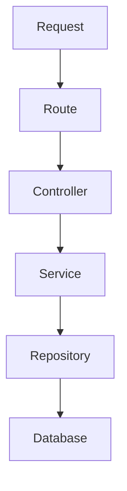

# NetTrace Alarm Analytics API - Technical Specification

## 📌 Project Overview
Build a high-performance API system serving:
* **Alarm Query:** Detailed alarm data query.
* **Alarm Analytics:** Trend and proportion analysis of network events.
* **Dashboard Visualization:** Provide data for NOC visualization charts.
* **Data Exploration:** Deep dive into error data patterns.
* **Root Cause Investigation:** Root cause investigation of issues.

### 💾 Data Storage
* **ClickHouse:** Stores Alarm Events (large volume data, optimized for analysis).
* **PostgreSQL:** Stores metadata (devices, station configuration, network errors) and dashboard template/preset configuration.

### ⚙️ Core Requirements
* Query alarm data by multiple dynamic filter conditions.
* Integrate Dashboard Analytics with capability to handle: Time Series, Top-N, Distribution, Heatmap, Compare.
* Support large volume data export.
* Execute application-level **Data Federation** between ClickHouse and PostgreSQL.
* Fully document all APIs using Swagger/OpenAPI.
* Scalability to hundreds of millions of records.

---

## 📌 Technology Stack
* **Runtime:** Node.js (ES2022+) & TypeScript.
* **Framework:** Express.js.
* **ClickHouse Client:** `@clickhouse/client` (Without ORM).
* **PostgreSQL Driver:** `pg` (Without ORM).
* **Validation:** `zod` (Mandatory usage, do not validate manually via if/else).
* **Logging:** `pino` & `pino-pretty`.
* **API Documentation:** `swagger-ui-express` & `swagger-jsdoc`.

---

## 📌 Architecture
The system is designed following a strict one-way layered model (Clean Layered Architecture):



### 🏢 Layer Responsibilities
1. **Route Layer:** Routes HTTP endpoints, registers middlewares (logging, validator). *Does not contain business logic.*
2. **Controller Layer:** Parses request, retrieves validated parameters, invokes Service layer and returns HTTP Response. *Does not contain business logic.*
3. **Service Layer:** Processes business logic, aggregation logic, coordinates **Data Federation** and maps output payloads.
4. **Repository Layer:** Constructs specific ClickHouse/PostgreSQL SQL queries. *Does not contain business logic.*
5. **Database Layer:** Manages connection pools, retry policies, and timeout settings.

---

## 📌 Database Architecture

### 🛸 ClickHouse Schema
Raw alarm events table:
```sql
CREATE TABLE alarms
(
    alarm_id String,
    error_code String,
    device_id String,
    time_created DateTime,
    time_solved Nullable(DateTime),
    status LowCardinality(String),
    severity LowCardinality(String),
    raw_log String,
    description String
)
ENGINE = MergeTree
PARTITION BY toDate(time_created)
ORDER BY (alarm_id);
```
> [!NOTE]
> ClickHouse is responsible for: Querying alarms, searching, filtering, aggregating, analytics, time series analysis, and computing durations. **Direct joins with PostgreSQL databases are strictly prohibited.**

### 🐘 PostgreSQL Schema
Consists of 4 metadata configuration tables designed as follows:

```sql
CREATE TABLE vendor (
    vendor_id VARCHAR(20) PRIMARY KEY,
    name VARCHAR(100) NOT NULL,
    country VARCHAR(50)
);

CREATE TABLE station (
    station_id VARCHAR(20) PRIMARY KEY,
    name VARCHAR(100) NOT NULL,
    longitude DOUBLE PRECISION,
    latitude DOUBLE PRECISION,
    province VARCHAR(100)
);

CREATE TABLE device (
    device_id VARCHAR(20) PRIMARY KEY,
    name VARCHAR(100) NOT NULL,

    vendor_id VARCHAR(20),
    station_id VARCHAR(20),

    device_type VARCHAR(50),
    ip_address VARCHAR(50),

    longitude DOUBLE PRECISION,
    latitude DOUBLE PRECISION,

    additional_info TEXT,

    CONSTRAINT fk_device_vendor
        FOREIGN KEY (vendor_id)
        REFERENCES vendor(vendor_id),

    CONSTRAINT fk_device_station
        FOREIGN KEY (station_id)
        REFERENCES station(station_id)
);

CREATE TABLE error (
    error_code VARCHAR(50) PRIMARY KEY,
    name VARCHAR(100) NOT NULL,

    description TEXT,
    domain VARCHAR(50),

    default_severity VARCHAR(20)
);

CREATE INDEX idx_device_vendor ON device(vendor_id); 

CREATE INDEX idx_device_station ON device(station_id);

CREATE INDEX idx_device_type ON device(device_type);

CREATE INDEX idx_station_longitude ON station(longitude);

CREATE INDEX idx_station_latitude ON station(latitude);
```

#### 🎛️ Dashboard Customization (Template, Widget, Preset)
Consists of tables to store user customized layout configurations:

```sql
CREATE TABLE template (
    template_id SERIAL PRIMARY KEY,
    name VARCHAR(255) NOT NULL,
    selected_cards TEXT,
    time_created TIMESTAMP DEFAULT CURRENT_TIMESTAMP,
    time_updated TIMESTAMP DEFAULT CURRENT_TIMESTAMP,
    number_of_widgets INT DEFAULT 0
);

CREATE TABLE preset (
    preset_id SERIAL PRIMARY KEY,
    preset_name VARCHAR(255),
    chart_type VARCHAR(100),
    metric VARCHAR(50),
    group_by VARCHAR(50),
    time_bucket VARCHAR(50),
    heatmap_mode VARCHAR(100),
    table_columns VARCHAR(500),
    table_page_size INT,
    table_record_limit INT
);

CREATE TABLE widget (
    widget_id SERIAL PRIMARY KEY,
    template_id INT NOT NULL,
    preset_id INT NOT NULL,
    position INT NOT NULL DEFAULT 0,
    start_date TIMESTAMP,
    end_date TIMESTAMP,
    time_created TIMESTAMP DEFAULT CURRENT_TIMESTAMP,
    time_updated TIMESTAMP DEFAULT CURRENT_TIMESTAMP,
    CONSTRAINT fk_widget_template
        FOREIGN KEY (template_id)
        REFERENCES template(template_id)
        ON DELETE CASCADE,
    CONSTRAINT fk_widget_preset
        FOREIGN KEY (preset_id)
        REFERENCES preset(preset_id)
        ON DELETE CASCADE
);

-- Indexes
CREATE INDEX idx_widget_template ON widget(template_id);
CREATE INDEX idx_widget_preset ON widget(preset_id);
CREATE INDEX idx_widget_position ON widget(position);
CREATE INDEX idx_preset_metric ON preset(metric);
CREATE INDEX idx_preset_group_by ON preset(group_by);
CREATE INDEX idx_preset_time_bucket ON preset(time_bucket);
```

Dashboard ownership rules:

* `template` owns layout metadata, selected KPI/layout snapshot, and widget count.
* `preset` owns reusable chart configuration only. Presets do not store date range or slot position.
* `widget` links a template to a preset and owns slot-specific fields: `position`, `start_date`, and `end_date`.
* Deleting a template cascade-deletes widget links through `fk_widget_template`; preset rows remain.
* Deleting a preset is blocked while any widget still references it.
* Preset fields must be normalized by `chart_type` before persistence so unused fields are stored as `NULL`.

> [!NOTE]
> PostgreSQL is responsible for: Looking up metadata, label enrichment, retrieving filter option lists, and storing dashboard templates/presets/widgets. **Do not execute alarm analytics queries on PostgreSQL.**

---

## 📌 Data Federation Rules

> [!IMPORTANT]
> **Core Principle:** Direct joins between ClickHouse and PostgreSQL databases are strictly prohibited.

Standard federated query flow:
```text
ClickHouse (Fetch Alarm data)
    ↓
Aggregate unique IDs in RAM (device_id, error_code)
    ↓
PostgreSQL (Query metadata matching IDs using WHERE id = ANY($1))
    ↓
Service Layer (Merge datasets using Hash Map lookups)
    ↓
Response (Return enriched response payload to client)
```

### 💡 Illustrative Example
* **Step 1 (Query ClickHouse):**
  ```sql
  SELECT alarm_id, device_id, severity, status FROM alarms;
  ```
* **Step 2 (Aggregate unique IDs in RAM):**
  ```javascript
  const deviceIds = [...new Set(rows.map(x => x.device_id))];
  ```
* **Step 3 (Query Postgres):**
  ```sql
  SELECT * FROM device WHERE device_id = ANY($1);
  ```
* **Step 4 (Map datasets in the Service Layer):**
  ```javascript
  alarm.device = deviceMap[alarm.device_id];
  ```

---
## 📌 Common Analytics Filter Contract
All Analytics APIs must share the common Filter DTO to leverage code reuse. Do not define separate query parameters contracts.

### Supported Query Parameters
```typescript
{
  from_time?: string;   // ISO-8601 string (Optional, default to 7 days ago)
  to_time?: string;     // ISO-8601 string (Optional, default to now)
  severity?: string[]; // List of severities
  status?: string[];   // List of statuses
  device_id?: string[];// List of devices to filter
  device_name?: string[];// Device names resolved through PostgreSQL metadata
  station_id?: string[];// Station IDs resolved through PostgreSQL device metadata
  error_code?: string[];// List of error codes to filter
  columns?: (        // Alarm response columns selected by the client
    | "alarm_id"
    | "time_created"
    | "time_solved"
    | "status"
    | "severity"
    | "error_code"
    | "error_name"
    | "error_domain"
    | "error_description"
    | "error_default_severity"
    | "device_id"
    | "device_name"
    | "device_type"
    | "vendor_id"
    | "station_name"
    | "station_id"
    | "station_province"
    | "vendor_name"
    | "vendor_country"
    | "ip_address"
    | "longitude"
    | "latitude"
    | "raw_log"
    | "description"
  )[];
  search?: string;      // Case-insensitive text search for detail alarm queries
  search_field?:        // Exactly one whitelisted field for Alarm Explorer search
    | "alarm_id"
    | "device_id"
    | "device_name"
    | "device_type"
    | "error_code"
    | "error_name"
    | "severity"
    | "status"
    | "description"
    | "raw_log";
  // Federated Postgres metadata filters:
  device_type?: string[];
  vendor?: string[];
  station?: string[];
  station_id?: string[];
  province?: string[];
}
```

* **Default Time Window:** If omitted by the client: `to_time = now()`, `from_time = now() - 7 days`.
* **Long Time Ranges:** Public requests may cover more than 90 days. Services must split them into internal ClickHouse windows of at most **90 days**, then merge or stream the combined result.
* **Alarm Column Projection:** `GET /api/v1/alarms` uses `columns` to select only fields required by the client. Metadata display columns (`device_name`, `vendor_name`, `error_name`, etc.) must automatically select the ClickHouse IDs needed for PostgreSQL enrichment. Do not use a hidden compact/full mode.
* **Alarm Explorer Search:** `GET /api/v1/alarms` supports backend search through `search` and exactly one `search_field`. ClickHouse-native fields are searched in ClickHouse; `device_name`, `device_type`, and `error_name` must be resolved through PostgreSQL first and then applied as `device_id` / `error_code` filters in ClickHouse. Do not implement page-only search for Alarm Explorer.

---

## 📌 API Design Principles

* **Reuse APIs:** One API endpoint should serve multiple chart types (e.g., Distribution API returning percentages can render Pie, Donut, Bar, or Treemap charts).
* **Pie Chart Presentation:** Pie charts are capped in the frontend: display the top 5 categories by value and combine remaining categories into `Other`. The backend should keep returning raw grouped rows.
* **ClickHouse First:** All heavy computations (count, group by, duration calculations, analytics) must execute on ClickHouse.
* **Offset-based Pagination:** Use offset-based pagination via limit and offset parameters (e.g., `LIMIT :limit OFFSET :offset`).
* **Partition Pruning:** The from_time and to_time filters are mandatory for all analytics APIs to leverage ClickHouse partition pruning. Long public ranges must still be queried as smaller time chunks.

---
## 📌 API Contracts

### 1. API Data Analytics
Cung cấp dữ liệu phục vụ phân tích, thống kê, và truy vấn thông tin cảnh báo (ClickHouse + PostgreSQL).

#### 1.1. Alarm Detail API
* **Endpoint:** `GET /api/v1/alarms`
* **Purpose:** Alarm table list view, drill-down queries from visualization charts.
* **Parameters:**
  * Time Filter: `from_time`, `to_time`
  * Alarm Filter: `severity`, `status`, `error_code`
  * Device Filter: `device_id`, `device_name`, `device_type`, `vendor`, `station`, `station_id`, `province`
  * Response Projection: `columns` (comma-separated alarm/table columns; metadata columns add required IDs internally)
  * Sorting: `sort_by` (`timestamp`, `severity`, `status`), `sort_order` (`asc`, `desc`)
  * Pagination: `offset` (number, default 0), `limit` (max 1000)
* **Pagination (Offset SQL):**
  ```sql
  ORDER BY time_created DESC, alarm_id DESC
  LIMIT :limit OFFSET :offset;
  ```

---

#### 1.2. Summary API
* **Endpoint:** `GET /api/v1/analytics/summary`
* **Purpose:** Provides statistics on total alerts, active/closed alert counts, critical alert counts, and the number of unique affected devices for Dashboard KPI cards.
* **Supported Filters:**
  * Common Analytics Filter Contract (including time filters, severity, device, vendor...)
* **Response Shape (HTTP 200):** Returns a JSON object with camelCase properties inside the `data` field:
  * `totalAlarms`: Total number of alarms.
  * `activeAlarms`: Number of active alarms (`status` is `active` or `ACTIVE`).
  * `closedAlarms`: Number of closed alarms (`status` is `closed`, `solved`, `CLOSED`, or `SOLVED`).
  * `criticalAlarms`: Number of alarms with severity `critical` or `CRITICAL`.
  * `affectedDevices`: Number of unique devices affected (`uniqExact(device_id)`).

---

#### 1.3. Analytics Query API
* **Endpoint:** `POST /api/v1/analytics/query`
* **Purpose:** Generic analytics query API serving:
  * Line Chart
  * Bar Chart
  * Pie Chart
  * Top-N Ranking
  * Trend Analysis

* **Request Body:**
  ```json
  {
    "metric": "count",
    "group_by": ["severity"],
    "time_bucket": null,
    "filters": {
      "severity": ["critical"],
      "status": ["open"],
      "device_type": ["wifi"]
    },
    "limit": 20
  }
  ```

* **Supported Metrics:**
  ```text
  count
  avg_duration
  max_duration
  affected_devices
  ```

* **Supported Group By (ClickHouse Native):**
  ```text
  severity
  status
  error_code
  ```

* **Supported Group By (Federated PostgreSQL):**
  ```text
  device
  device_type
  vendor
  station
  province
  ```

* **Supported Time Buckets:**
  ```text
  hour
  day
  week
  month
  year
  ```

* **Examples / Use Cases:**

  Top 10 devices producing alarms:

  ```json
  {
    "metric": "count",
    "group_by": ["device"],
    "limit": 10
  }
  ```

  Severity proportions:

  ```json
  {
    "metric": "count",
    "group_by": ["severity"]
  }
  ```

  Alarms count aggregated by day:

  ```json
  {
    "metric": "count",
    "time_bucket": "day"
  }
  ```

  WiFi devices Critical + Open alarms:

  ```json
  {
    "metric": "count",
    "group_by": ["device"],
    "filters": {
      "severity": ["critical"],
      "status": ["open"],
      "device_type": ["wifi"]
    }
  }
  ```

---

#### 1.4. Heatmap API
* **Endpoint:** `POST /api/v1/analytics/heatmap`
* **Purpose:** Density map of network alarms over time.
* **Supported Filters:**
  * `from_time`, `to_time`
  * `severity`, `status`
  * `error_code`
  * `device_id`, `device_type`
  * `vendor`, `station`, `province`

* **Parameters:** `mode`

### Mode: `weekday`
Hour × Day of Week

```sql
SELECT
    toDayOfWeek(time_created) AS day_of_week,
    toHour(time_created) AS hour,
    count() AS count
FROM alarms
WHERE time_created BETWEEN :from_time AND :to_time
GROUP BY day_of_week, hour;
```

### Mode: `calendar`
Day of Year contribution map (GitHub contribution style)

```sql
SELECT
    toDate(time_created) AS day,
    count() AS count
FROM alarms
WHERE time_created BETWEEN :from_time AND :to_time
GROUP BY day;
```

* **Response Shape:**

### Mode: `weekday`
```json
[
  {
    "x": 13,
    "y": "Monday",
    "value": 120
  }
]
```

### Mode: `calendar`
```json
[
  {
    "day": "2025-01-01",
    "value": 120
  }
]
```

* **Notes:**
  * The `from_time` and `to_time` are mandatory to leverage Partition Pruning.
  * `OFFSET` is not supported.
  * Avoid loading large volume datasets into RAM.
  * Return grouped aggregation datasets only.

---

#### 1.5. Export API
* **Endpoint:** `POST /api/v1/export`
* **Purpose:** Exports filtered alarm records to CSV, Excel, JSON, or compact PDF.
* **Formats:**
  * `csv`
  * `xlsx`
  * `json`
  * `pdf`
* **Requirements:**
  * Must use streaming for CSV, XLSX, and JSON outputs.
  * PDF output is for bounded review reports; use practical limits and do not treat it as the massive dataset format.
  * Do not load large volume datasets into RAM.
  * Support exporting massive datasets.
* **Request Body Schema:**
  ```json
  {
    "format": "csv" | "xlsx" | "json" | "pdf",
    "columns": ["alarm_id", "severity", "status", "device_name", "error_name", "..."], // Optional. If omitted, exports all columns.
    "filters": {
      // Common Analytics Filter Contract:
      "from_time": "2026-06-01T00:00:00Z",
      "to_time": "2026-06-07T23:59:59Z",
      "severity": ["critical"],
      "device_type": ["wifi"],
      // Sorting and limits:
      "sort_by": "timestamp" | "severity" | "status",
      "sort_order": "asc" | "desc",
      "limit": 1000
    }
  }
  ```

#### 1.6. Metadata Options API
* **Endpoint:** `GET /api/v1/metadata/options`
* **Purpose:** Provides searchable PostgreSQL metadata values for UI dropdown filters.
* **Returned categories:**
  * `deviceTypes`
  * `vendors`
  * `stations`
  * `provinces`
* **Query Parameters:**
  * `search` optional, max 100 characters.
  * `limit` optional, 1-1000. If omitted, return all matching values per category.
* **Requirements:**
  * Must use Zod validation.
  * Must keep response inside the standard success envelope.
  * Must use raw parameterized SQL through the repository layer.
---

### 2. Template & Widget APIs
Manage custom dashboard layouts (Template, Widget, Preset) for users.

#### 2.1. Create Template API
* **Endpoint:** `POST /api/v1/templates`
* **Purpose:** Creates a new Template and links widget slots to presets. Existing presets are reused by `preset_id`; new custom widget configs create a preset first. Executed in a PostgreSQL Transaction to guarantee atomicity.
* **Request Body (application/json):**
  ```json
  {
    "name": "string (required, layout template name)",
    "selected_cards": "string (optional, JSON string array of KPI cards chosen by the user)",
    "widgets": [
      {
        "preset_id": "number (optional, existing reusable preset ID; if provided, no new preset is created)",
        "preset_name": "Critical router alarms",
        "position": "number (widget grid position index)",
        "chart_type": "string (rendering chart type)",
        "start_date": "string (optional, ISO-8601 date-time)",
        "end_date": "string (optional, ISO-8601 date-time)",
        "metric": "string (optional, analytics metric)",
        "group_by": "string (optional, chart grouping field)",
        "time_bucket": "string (optional, time bucket for time-series charts)",
        "heatmap_mode": "string (optional, heatmap mode)",
        "table_columns": "string (optional, encoded table columns)"
      }
    ]
  }
  ```
* **Response Shape (HTTP 201):**
  ```json
  {
    "success": true,
    "data": {
      "template_id": 1,
      "name": "My Dashboard Template",
      "selected_cards": "[\"totalAlarms\"]",
      "number_of_widgets": 1,
      "time_created": "2026-06-21T10:15:00.000Z",
      "time_updated": "2026-06-21T10:15:00.000Z"
    }
  }
  ```

#### 2.2. List Templates API
* **Endpoint:** `GET /api/v1/templates`
* **Purpose:** Retrieve a paginated list of created templates.
* **Query Parameters:**
  * `limit`: default 20, max 1000 (mandatory offset-based pagination parameters).
  * `offset`: default 0.
* **Response Shape (HTTP 200):**
  ```json
  {
    "success": true,
    "data": [
      {
        "template_id": 1,
        "name": "My Dashboard Template",
        "selected_cards": "[\"totalAlarms\"]",
        "number_of_widgets": 1,
        "time_created": "2026-06-21T10:15:00.000Z",
        "time_updated": "2026-06-21T10:15:00.000Z"
      }
    ]
  }
  ```

#### 2.3. Retrieve Detailed Template API
* **Endpoint:** `GET /api/v1/templates/:id`
* **Purpose:** Fetch layout details of a template along with all its widgets and preset filters.
* **Response Shape (HTTP 200):**
  ```json
  {
    "success": true,
    "data": {
      "template_id": 1,
      "name": "My Dashboard Template",
      "selected_cards": "[\"totalAlarms\"]",
      "number_of_widgets": 1,
      "time_created": "2026-06-21T10:15:00.000Z",
      "time_updated": "2026-06-21T10:15:00.000Z",
      "widgets": [
        {
          "widget_id": 1,
          "preset_id": 42,
          "position": 1,
          "start_date": "2026-06-01T00:00:00.000Z",
          "end_date": "2026-06-30T23:59:59.000Z",
          "time_created": "2026-06-21T10:15:00.000Z",
          "time_updated": "2026-06-21T10:15:00.000Z",
          "preset": {
            "preset_id": 42,
            "preset_name": "Critical router alarms",
            "chart_type": "line",
            "metric": "count",
            "group_by": "severity",
            "time_bucket": "day",
            "heatmap_mode": "weekday",
            "table_columns": null
          }
        }
      ]
    }
  }
  ```

#### 2.4. Update Template API
* **Endpoint:** `PUT /api/v1/templates/:id`
* **Purpose:** Updates Template details and synchronizes widget links inside a PostgreSQL Transaction. Existing presets are reused by `preset_id`; custom widget configs create new presets. Automatically updates number_of_widgets and time_updated.
* **Request Body (application/json):**
  ```json
  {
    "name": "string",
    "selected_cards": "string",
    "widgets": [
      {
        "preset_id": "number",
        "preset_name": "Critical router alarms",
        "position": "number",
        "chart_type": "string",
        "start_date": "string",
        "end_date": "string",
        "metric": "string",
        "group_by": "string",
        "time_bucket": "string",
        "heatmap_mode": "string",
        "table_columns": "string"
      }
    ]
  }
  ```
* **Response Shape (HTTP 200):**
  ```json
  {
    "success": true,
    "data": {
      "template_id": 1,
      "name": "Updated Template",
      "selected_cards": "[\"totalAlarms\"]",
      "number_of_widgets": 1,
      "time_created": "2026-06-21T10:15:00.000Z",
      "time_updated": "2026-06-21T17:15:00.000Z"
    }
  }
  ```

#### 2.5. Delete Template API
* **Endpoint:** `DELETE /api/v1/templates/:id`
* **Purpose:** Delete Template. Associated widget links cascade-delete via FK; preset rows remain reusable.
* **Response Shape (HTTP 200):**
```json
  {
    "success": true,
    "data": {
      "message": "Template and associated widgets deleted successfully"
    }
  }
```

#### 2.6. Standalone Preset APIs
* **Endpoints:** `GET /api/v1/presets`, `POST /api/v1/presets`, `PUT /api/v1/presets/:id`, `DELETE /api/v1/presets`
* **Purpose:** List reusable presets and create presets that are not yet assigned to a template.
* **Behavior:** Creating a preset inserts only into `preset`. A `widget` row is created later when the preset is assigned to a template. Editing a preset (`PUT`) updates its metadata. Deleting a preset (`DELETE` with `{"ids": [...]}`) removes only unused presets.
* **Delete Guard:** Deleting a preset is rejected with HTTP 409 when the preset is still referenced by a `widget` row.
* **Create/Update Request:** Requires `preset_name` and uses semantic preset fields (`metric`, `group_by`, `time_bucket`, `heatmap_mode`, `table_columns`, `table_page_size`, `table_record_limit`). Slot `position` and date range belong to `widget`, not `preset`.
* **Chart-Type Normalization:** Preset persistence must store irrelevant fields as `NULL`:
  * `line`: keep `metric`, `time_bucket`; clear `group_by`, `heatmap_mode`, `table_columns`.
  * `bar`: keep `metric`; keep `group_by` only when not `none`; keep `time_bucket` only when ungrouped; clear `heatmap_mode`, `table_columns`.
  * `pie`: keep `metric`, `group_by`; clear `time_bucket`, `heatmap_mode`, `table_columns`.
  * `table`: keep `table_columns`, `table_page_size`, and `table_record_limit`; clear `metric`, `group_by`, `time_bucket`, `heatmap_mode`.
  * `heatmap`: keep `heatmap_mode`; clear `metric`, `group_by`, `time_bucket`, `table_columns`.
* **List Response:** Includes `preset_name` plus assignment metadata (`template_id`, `template_name`) when the preset is in use.
* **Create Response:** HTTP 201 with a `PresetResponse`, including `preset_name`.

---

## 📌 ClickHouse Optimization Rules
* **Avoid SELECT *:** Always explicitly declare target column projections.
* **Prioritize primary key filtering:** Filter on fields included in the sorting/order key (time_created, severity, status).
* **LowCardinality:** Apply on low-cardinality columns like severity and status to optimize disk compression.
* **PREWHERE:** Always use PREWHERE for time ranges to load the minimal set of column bytes into RAM.

---

## 📌 Connection & System Management

### ⚙️ Connection Management
* **PostgreSQL Pool:** Configure Postgres Pool with new Pool({ max: 20 }).
* **ClickHouse Client:** Mandatory usage of Singleton Pattern to share client connection globally.
* **Database Transaction Policy (PostgreSQL):** When executing create/update Template APIs, you must open a raw Transaction (BEGIN, COMMIT, ROLLBACK) on the PostgreSQL client to guarantee atomicity across Template, Widget, and Preset tables. The connection client must be returned to the pool in a finally block.

### ⏱️ Query Timeout & SLA
* **PostgreSQL Timeout:** `5s`.
* **ClickHouse Timeout:** `30s`.
* *Timeout Handling:* Cancel/kill active query, log warning/error via Pino (appLogger.error), and return HTTP Status 504 Database Timeout.

### 🛡️ Query Safety Rules
* **Max Top-N:** Limit N <= 1000.
* **Max Group By Columns:** Maximum 3 columns.
* **Sorting Whitelist:** Only allow sorting on time_created (or timestamp), severity, status, and count. Direct raw SQL strings passed as sort columns from the client are prohibited.

---

## 📌 Response Standards

### ✅ Success Response (HTTP 200)
```json
{
  "success": true,
  "data": [],
  "meta": {
    "execution_time_ms": 120
  }
}
```

### ❌ Error Response (HTTP 4xx / 5xx)
```json
{
  "success": false,
  "error": {
    "code": "INVALID_TIME_RANGE",
    "message": "from_time must be earlier than to_time"
  }
}
```

* **Custom error codes:**
  * HTTP 404: `TEMPLATE_NOT_FOUND` - Returned when querying a template that does not exist.

### 🚥 HTTP Status Codes
* **200:** Success (or 201 Created for Create Template API).
* **400:** Input Validation error.
* **404:** Resource not found.
* **429:** Too many requests (Rate Limited).
* **500:** Internal server error.
* **504:** Database query exceeded SLA timeout.

---

## 📌 Logging & Observability
Mandatory usage of Pino. Output structured JSON logs for centralized log collectors.

### Required Fields for HTTP Logging
```json
{
  "request_id": "req_123",
  "endpoint": "/api/v1/alarms",
  "clickhouse_query_time_ms": 95,
  "postgres_query_time_ms": 12,
  "execution_time_ms": 110,
  "records_returned": 100
}
```
> [!WARNING]
> Any API request responding slower than the threshold SLA (5s for standard REST, 2s for analytics, 3s for export) must emit a warn log using appLogger.warn.

---

## 📌 Performance Targets
* **Alarm Query API:** P95 < 5s
* **Analytics APIs:** P95 < 2s
* **Distribution / Top-N APIs:** P95 < 3s

---

## 📌 Testing & Definition Of Done

### 🧪 Testing Requirements
* **Mandatory:** Write Unit Tests for Service layer and validation schema objects; write Unit Tests verifying Zod schemas (`createTemplateSchema`, `updateTemplateSchema`, `getTemplateSchema`).
* **Recommended:** Write Integration Tests targeting a simulated PostgreSQL DB; verify database transaction atomicity during create/update Template calls (ensure failure in Widget/Preset insertion triggers a clean rollback of the Template record).

### 🏁 Definition Of Done (DOD)
* Implement all 8 functional APIs (including alarms, summary, analytics, heatmap, export) according to specifications.
* Implement all dashboard template CRUD endpoints.
* Verify data federation works correctly at the application layer without direct joins between ClickHouse and PostgreSQL.
* Ensure transaction atomicity and sync integrity of relations (Template -> Widget -> Preset) using raw PostgreSQL transactions.
* Strict payload validation with Zod. Comprehensive structured logs with Pino.
* Ensure offset/limit pagination works smoothly.
* No ORM usage, no SELECT * statements.
* Expose interactive Swagger documentation at `/api-docs`.
* Ensure PostgreSQL Template management APIs maintain a response SLA of P95 < 5s.
