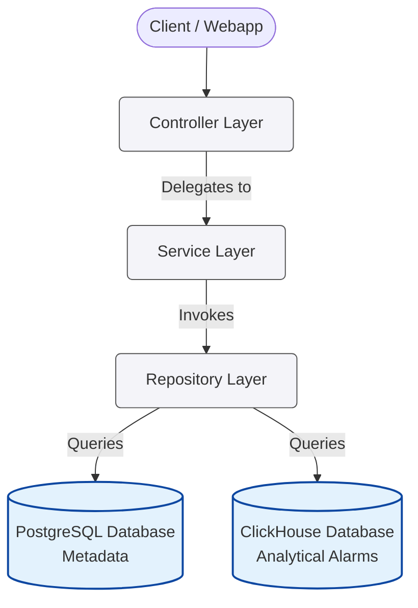

# NetTrace System Architecture

This document describes the system architecture, major components, and responsibilities of each layer within the NetTrace Alarm Analytics backend.

## Architecture Overview

The backend follows a practical one-way layered structure around Express request handling. The source code contains Express route modules, but these routes are HTTP routing/adapters, not a separate business layer. Request handling moves from HTTP routing into controllers, then services, repositories, and database clients.

## Major Components & Layer Responsibilities

### 1. Express Router / HTTP Adapter
* **Responsibility:** Maps HTTP verbs and request URL paths to their corresponding controllers.
* **Key Tasks:**
  * Defines routes under the `/api/v1` namespace.
  * Registers validation middleware before controller invocation.
  * Declares Swagger OpenAPI specs via JSDoc comments to act as the API contract.
  * *Does not contain business logic or query logic.*

### 2. Controller Layer
* **Responsibility:** Serves as the entry and exit point for API requests.
* **Key Tasks:**
  * Extracts inputs (query parameters, path parameters, body payloads) validated by the validator middleware from `res.locals`.
  * Delegates processing to the appropriate Service class.
  * Catches exceptions, delegates them to custom global error handlers, and returns standard HTTP Responses with consistent payload structure.
  * *Does not contain database access or business logic.*

### 3. Service Layer
* **Responsibility:** Implements business logic and acts as the orchestrator of data.
* **Key Tasks:**
  * Coordinates application-level **Data Federation** (stitching ClickHouse analytical records with PostgreSQL configuration metadata).
  * Performs in-memory mapping, transformations, sorting, and defaults (e.g., expanding date ranges, validating that range sizes do not exceed safety limits).
  * *Does not build raw database queries directly.*

### 4. Repository Layer
* **Responsibility:** Abstracts the details of data storage engines.
* **Key Tasks:**
  * Constructs raw, optimized SQL queries for PostgreSQL.
  * Constructs optimized SQL queries for ClickHouse using driver features.
  * Enforces query performance directives (such as whitelist sorting and pagination counts).
  * *Does not contain business logic or coordinate joins between databases.*

### 5. Database Layer
* **Responsibility:** Manages infrastructure connections.
* **Key Tasks:**
  * Manages the PostgreSQL connection pool (configured with maximum 20 connections, 5s timeout).
  * Manages the ClickHouse HTTP client connection using a singleton pattern.
  * Handles transaction boundaries on PostgreSQL client checkouts.

## Component Interactions

All component interactions are downstream in the current backend implementation. Request handling flows from Express Router / HTTP Adapter to Controller to Service to Repository to the Databases. The result is returned back up the call stack to the Controller, which responds to the client. Direct communication between repositories and controllers, or services and routers, is not used in the current source code.
